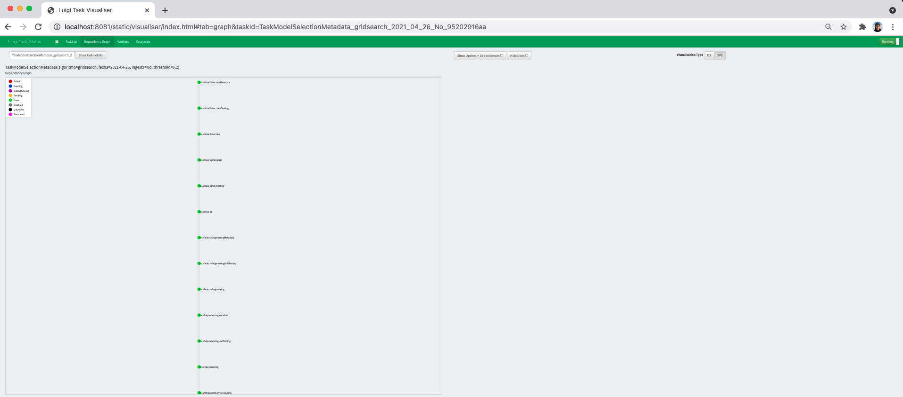

# Food inspection 

Los colaboradores en este proyecto somos:

| Nombre | usuario github |
|-------|-----------------|
| Cecilia Avilés | cecyar |
| Leonardo Ceja | lecepe00 |
| Eduado Moreno | Eduardo-Moreno|
| Carolina Acosta | caroacostatovany |

## Pregunta analítica a contestar con el modelo predictivo

¿El establecimiento pasará o no la inspección?

# Base de datos
La base de datos que se analizará en este trabajo será la de [Chicago food inspection](https://data.cityofchicago.org/Health-Human-Services/Food-Inspections/4ijn-s7e5).

También se puede encontrar en nuestro [_Kaggle_](https://www.kaggle.com/carotovany/food-inspections), de acuerdo a la frecuencia de actualización del producto de datos, que será semanal.

### Resumen

- Al día 15 de enero del 2021 contamos con 215,067 registros.

#### Columnas

| Nombre de la columna | Descripción | Tipo de variable | Registros únicos (15 enero) |
|----------------------|--------------|-----------------|------------------|
|Inspection ID | ID de la inspección realizada|texto | 215,067 |
|DBA Name| Nombre del establecimiento |texto | 28,748|
|AKA Name| (Also known as) Nombre común del establecimiento |texto | 27,356 |
|License #| Número de la licencia del inspector |texto | 39,103 |
|Facility Type| Tipo de establecimiento |categórico (texto) | 501 |
|Risk| Tipo de Riesgo |categórico (numérico-texto) | 5 |
|Address| Dirección del establecimiento |texto | 18,522 |
|City| Ciudad en la que se encuentra el establecimiento |categórico(texto) | 71 |
|State| Estado en el que se encuentra el establecimiento |categrico(texto) | 5 |
|Zip| Código Postal del establecimiento |categorico(numérico) | 112 |
|Inspection Date| Fecha en la que se realizó la inspección |fecha | 2,796 |
|Inspection Type| Tipo de inspección que se realizó |categórico (texto)| 111 |
|Results* | Resultado de la inspección |categórico(texto) | 7 |
|Violations| Violaciones que ha realizado el establecimiento |texto | 156,639 |
|Latitude| Latitud |numérico | 17,246  |
|Longitude| Longitud |numérico | 17,246 |
|Location| Latitud y longitud |vector numérico | 17,247 |

*Variable target. 

### Frecuencia de actualización de los datos

La frecuencia de actualización de los datos en la base de datos original es diaria, la del producto de datos para este proyecto será semanal.

# Lenguaje de programación

Python 3.7.4

Se agregó un archivo `.python-version` que indica que nuestro ambiente virtual se llama `food-inspection`.

# EDA
Podrás encontrar nuestro notebook del Análisis Exploratorio en la siguiente ruta:

+ `notebooks/eda/EDA_GEDA.ipynb`

# Ejecución 

### Instrucciones para correr TODOS los tipos de ejecuciones (Funciones, scripts, jupyter o luigi)

1. Crea un ambiente virtual llamado `food-inspection`, actívalo e instala los `requirements.txt` con el siguiente comando:
> `pip install -r requirements.txt`

2. En la terminal, posiciónate en la raíz del repositorio y ejecuta:
>  `export PYTHONPATH=$PWD`

**Notas:** en `src/utils/constants.py` mantenemos las constantes de nuestro proyecto, donde tenemos referenciado el nombre de nuestro bucket: ` "data-product-architecture-equipo-3"`  y la ruta de las credenciales para acceder al bucket (`"../conf/local/credentials.yaml"`).   
Si quieres acceder a diferentes buckets con otras credenciales esto se deberá cambiar en el archivo de las constantes. También hay un **FAQ** al último de este archivo, donde podrás encontrar más respuestas sobre las constantes.

### Con Luigi

Después de correr las instrucciones generales, escribimos algunos ejemplos de cómo correr tareas en Luigi.


**Nota:** Antes de correr algunos ejemplos, asegura que en tu **RDS** tengas creado el schema `metadata` y `test`. O puedes correr el sql que se encuentra en la carpeta `sql` bajo el nombre de "create_metadata_tables.sql" y "create_unittesting_tables.sql".

Algunos ejemplos para correr:

Para entrenamiento:
Existen los parámetros --ingesta , que puede tener los valores de "no", "inicial" y "consecutiva", --fecha con la que se quiere correr el pipeline y --algoritmo donde el default es "gridsearch" y toma los algoritmos declarados en nuestras constantes, la etiqueta de --algoritmo también funciona con "dummyclassifier" por el momento.
> PYTHONPATH=$PWD AWS_PROFILE=<tu_profile_en_aws_config> luigi --module src.pipeline.training_luigi TaskTrainingMetadata --fecha "2021-04-19" --algoritmo gridsearch

Para la selección de modelo:
Sólo existen los parámetros --ingesta , que puede tener los valores de "no", "inicial" y "consecutiva", --fecha con la que se quiere correr el pipeline,  --algoritmo donde el default es "gridsearch" y toma los algoritmos declarados en nuestras constantes y --threshold que indica el score deseado para seleccionar el mejor modelo. La etiqueta de --algoritmo también funciona con "dummyclassifier" por el momento.
> PYTHONPATH=$PWD AWS_PROFILE=default luigi --module src.pipeline.model_select_luigi TaskModelSelectionMetadata --fecha "2021-04-19" --threshold 0.8

### De Notebooks

1. En la carpeta `data`, coloca el archivo `Food_Inspections.csv`.
2. En la terminal, (una vez que hayas hecho todo lo anterior, instalar requirements y cargar la raíz como parte del PYTHONPATH) posiciónate en la raíz y ejecuta:
> `jupyter notebook`


### Sobre tus credenciales

En la carpeta `conf/local` deberás colocar tu archivo `credentials.yaml`. La estructura del mismo debe ser la siguiente:
```
s3:
    aws_access_key_id: "tuaccesskeyid"
    aws_secret_access_key: "tusecretaccesskey"
food_inspections:
    app_token: "tutoken"
    username: "tuusername"
    password: "tucontraseña"
db:
    user: "tu_username"
    pass: "tu_contraseña"
    host: "tu_host"
    port: "5432" 
    db: "nombre_de_tu_bd"
```

Para poder ejecutar Luigi, se deberá modificar el archivo de credenciales de AWS(~/.aws/credentials) y deberá tener la estructura siguiente:
```
[tu_profile]
    aws_access_key_id = tuaccesskeyid
    aws_secret_access_key = tusecretaccesskey
    region = tu-region
```

## FAQ
### ¿Qué hace el proceso de ingestión inicial?
**R:** La función de `ingesta_inicial` utiliza el cliente, que se conectó previamente a **data.cityofchicago.org** a través de *Socrata* y un *token*, para obtener datos del dataset: **Food inspections (ID: 4ijn-s7e5)** con un límite de *data points* por *default* de 300,000. Una vez obtenidos, se guardan en un bucket de AWS especificado en `constants.py`, en el path: `ingestion/inital` bajo el nombre de `historic-inspections-{dia_de_hoy}.pkl`.

### ¿Qué hace el proceso de ingestión consecutiva?
**R:** La función de `ingesta_consecutiva` utiliza el cliente, que se conectó previamente a **data.cityofchicago.org** a través de *Socrata* y un *token*, y una fecha para obtener datos del dataset: **Food inspections (ID: 4ijn-s7e5)** con un límite de *data points* por *default* de 1,000 y desde 7 días antes a la fecha especificada hasta la fecha especificada en la variable `fecha`. Una vez obtenidos, se guardan en un bucket de AWS especificado en `constants.py`, en el path: `ingestion/consecutive` bajo el nombre de `consecutive-inspections-{fecha_hoy}.pkl`.

### ¿Qué contiene el preprocessing?
**R:** La función de `preprocessing` cambia todas las columnas de tipo string a minúsculas, renombra la ciudad de chicago a los que fueron mal escritos, se imputan valores nulos con ciertas características (ver función `convert_nan`) y transforma la etiqueta en 0 y 1 (1 para los resultados en "Pass" y "Pass w/ conditions", 0 para el resto). 

### ¿Qué contiene el feature engineering?
**R:** La función de `feature generation` transforma las fechas a su tipo date, quita renglones donde tenga algún nulo que no se pudo limpiar en el preprocessing y agrega nuevas variables como: 'year', 'month', 'day', 'dayofweek', 'dayofyear', 'week', 'quarter', 'num_violations' y por último hace la transformación de features categóricos con OneHotEncoder. 

### ¿Qué contiene el entrenamiento?
**R:** La función de `fit_training_food` entrena con un GridSearchCV de acuerdo con el algoritmo dado; y los parámetros los toma de una constante definida en `src.utils.model_constants.py`. Regresa el mejor modelo de ese algoritmo.

### ¿Qué contiene el model selection?
**R:** La función de `best_model_selection` selecciona el mejor modelo (que se encuentran en el bucket de dentro de la carpeta models) que tenga mejor score y cumpla con el threshold dado por el cliente, si no hay regresa vacío. 

### ¿Qué debo cambiar si quiero adaptarlo a mi bucket y PATHS?
**R:** Si deseas cambiar algunos paths debes hacerlo en el archivo de `constants.py` que se encuentra en `src.utils`. 
Si deseas cambiar algún path de cómo se guarda, modifica los que dicen PATHS. Si quieres modificar los nombres de los archivos, modifica los que dicen NOMBRES.

Si deseas cambiar los modelos a probar en el GridSearch, modifica `src.utils.model_constants.py`.

### ¿Cómo se debe ver mi DAG en Luigi?
**R** Si Luigi corrió bien todas las tareas, se debe ver así:



## Arquitectura
La arquitectura que construimos en nuestro proyecto fue la siguiente:

\* Tomado del github de [ITAM-DS/data-product-architecture](https://github.com/ITAM-DS/data-product-architecture)


**Bastion:**
- EC2 instance:  t3.small
- Volume size:  20Gb
- AMI:  Ubuntu 18
- Region:  us-east-1

**EC2 Procesamiento:**
- EC2 instance:  c5.2xlarge
- Volume size:  20Gb
- AMI:  Ubuntu 18
- Region:  us-east-1

**RDS:**
- DB:  Postgresql 10.6
- Class: db.t2.micro
- Storage:  20Gb (autoscaling enabled)
- Region:  us-east-1
- Encryption:  Not enabled
- Maintenance window:  Thursdays 3:35-3:55 CST
- Public accessibility:  No

## Pruebas unitarias

Por ahora las pruebas unitarias con las que contamos son:

| Módulo | Nombre prueba unitaria | Descripción |
| ------ | ---------------------- | ----------- |
| Ingesta | test_ingesta | Revisa que el archivo creado en ingesta pese más de 1KB |
| Almacenamiento | test_almacenamiento_json | Revisa que el archivo guardado sea un json |
| Preprocesamiento | test_preprocessing_label | Revisa la etiqueta del dataframe sea 0 ó 1 |
| Feature Engineering | test_feature_engineering_month | Revisa que la columna month del dataframe este entre 1 y 12 |
| Entrenamiento | test_training_gs | Revisa que el archivo es un objeto GridSearchCV |
| Selección de modelos | test_model_select | Revisa que el modelo sea distinto a la cadena vacia que indica que no hubo mejor modelo |