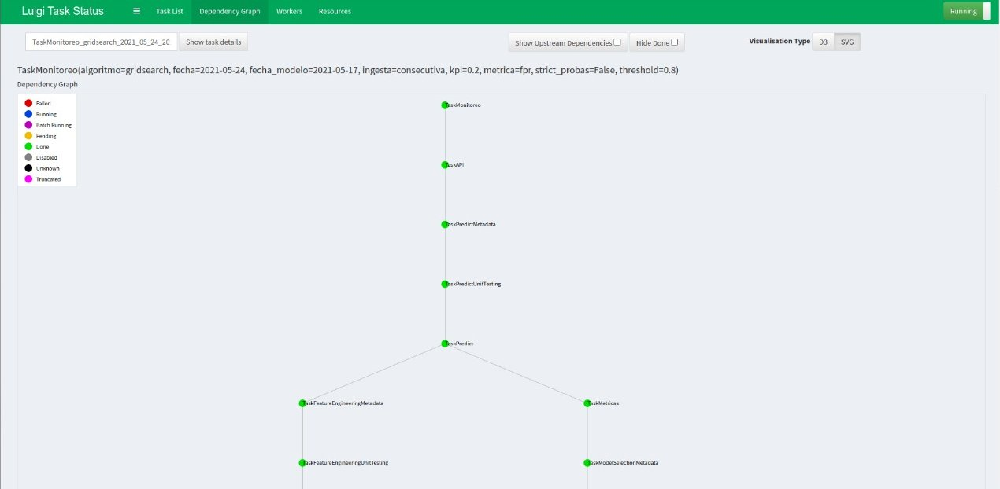
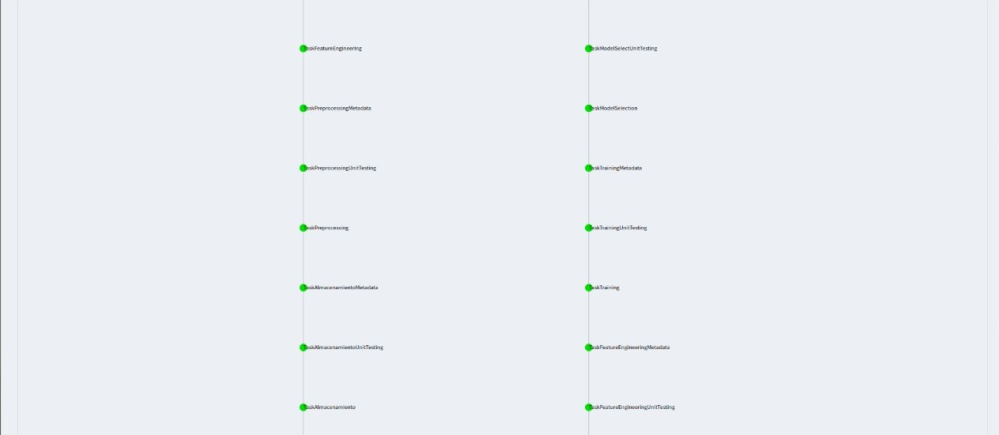
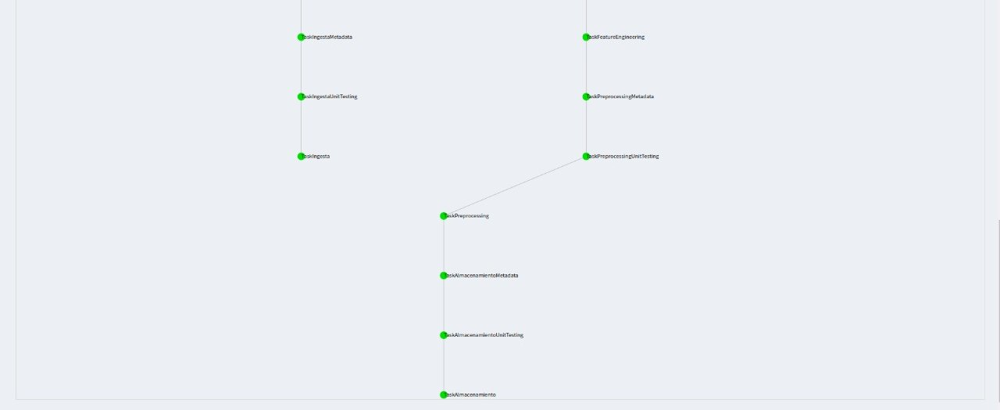

# Food inspection 

Los colaboradores en este proyecto somos:

| Nombre | usuario github |
|-------|-----------------|
| Cecilia Avilés | cecyar |
| Leonardo Ceja | lecepe00 |
| Eduado Moreno | Eduardo-Moreno|
| Carolina Acosta | caroacostatovany |

## Pregunta analítica a contestar con el modelo predictivo

¿El establecimiento pasará o no la inspección?

# Base de datos
La base de datos que se analizará en este trabajo será la de [Chicago food inspection](https://data.cityofchicago.org/Health-Human-Services/Food-Inspections/4ijn-s7e5).

También se puede encontrar en nuestro [_Kaggle_](https://www.kaggle.com/carotovany/food-inspections), de acuerdo a la frecuencia de actualización del producto de datos, que será semanal.

### Resumen

- Al día 15 de enero del 2021 contamos con 215,067 registros.

#### Columnas

| Nombre de la columna | Descripción | Tipo de variable | Registros únicos (15 enero) |
|----------------------|--------------|-----------------|------------------|
|Inspection ID | ID de la inspección realizada|texto | 215,067 |
|DBA Name| Nombre del establecimiento |texto | 28,748|
|AKA Name| (Also known as) Nombre común del establecimiento |texto | 27,356 |
|License #| Número de la licencia del inspector |texto | 39,103 |
|Facility Type| Tipo de establecimiento |categórico (texto) | 501 |
|Risk| Tipo de Riesgo |categórico (numérico-texto) | 5 |
|Address| Dirección del establecimiento |texto | 18,522 |
|City| Ciudad en la que se encuentra el establecimiento |categórico(texto) | 71 |
|State| Estado en el que se encuentra el establecimiento |categrico(texto) | 5 |
|Zip| Código Postal del establecimiento |categorico(numérico) | 112 |
|Inspection Date| Fecha en la que se realizó la inspección |fecha | 2,796 |
|Inspection Type| Tipo de inspección que se realizó |categórico (texto)| 111 |
|Results* | Resultado de la inspección |categórico(texto) | 7 |
|Violations| Violaciones que ha realizado el establecimiento |texto | 156,639 |
|Latitude| Latitud |numérico | 17,246  |
|Longitude| Longitud |numérico | 17,246 |
|Location| Latitud y longitud |vector numérico | 17,247 |

*Variable target. 

### Frecuencia de actualización de los datos

La frecuencia de actualización de los datos en la base de datos original es diaria, la del producto de datos para este proyecto será semanal.

# Lenguaje de programación

Python 3.7.4

Se agregó un archivo `.python-version` que indica que nuestro ambiente virtual se llama `food-inspection`.

# EDA
Podrás encontrar nuestro notebook del Análisis Exploratorio en la siguiente ruta:

+ `notebooks/eda/EDA_GEDA.ipynb`

# Ejecución 

### Instrucciones para correr TODOS los tipos de ejecuciones (Funciones, scripts, jupyter o luigi)

1. Crea un ambiente virtual llamado `food-inspection`, actívalo e instala los `requirements.txt` con el siguiente comando:
> `pip install -r requirements.txt`

2. En la terminal, posiciónate en la raíz del repositorio y ejecuta:
>  `export PYTHONPATH=$PWD`

**Notas:** en `src/utils/constants.py` mantenemos las constantes de nuestro proyecto, donde tenemos referenciado el 
nombre de nuestro bucket: ` "data-product-architecture-equipo-3"`  y la ruta de las credenciales para acceder al bucket (`"../conf/local/credentials.yaml"`).   
Si quieres acceder a diferentes buckets con otras credenciales esto se deberá cambiar en el archivo de las constantes. 
También hay un **FAQ** al último de este archivo, donde podrás encontrar más respuestas sobre las constantes.

### Con Luigi

Después de correr las instrucciones generales, escribimos algunos ejemplos de cómo correr tareas en Luigi.

**Nota 1:** Recuerda antes ejecutar `luigid` en tu terminal y que se habilite el puerto `8082` para ver el DAG.

**Nota 2:** Antes de correr algunos ejemplos, asegura que en tu **RDS** tengas creado el schema `metadata`, `test`, 
`results`, `semantic`, `api` y `monitoring`
O puedes correr el sql que se encuentra en la carpeta `sql` bajo el nombre de "create_metadata_tables.sql", 
"create_unittesting_tables.sql", "create_semantic_tables.sql", "create_results_tables.sql", "create_api_tables.sql" y
"create_monitoring_tables.sql"

Algunos ejemplos para correr:

**Para predicciones**

Existen los parámetros:
* --ingesta, que puede tener los valores de "no", "inicial" y "consecutiva",
* --fecha-modelo, fecha para escoger el modelo corrido y utilizarlo para las predicciones,
* --fecha con la que se quiere correr el pipeline y hacer la nueva ingesta para predicciones
* --threshold que indica el score deseado para seleccionar el mejor modelo,
* --metrica para indicar la métrica a enfocarse,
* --kpi para seleccionar el límite para dicha métrica y así seleccionar el punto de corte 
* --strict-probas, que fallará la prueba unitaria porque busca que los scores esten estrictamente debajo de 1 y arriba de 0.
> PYTHONPATH=$PWD AWS_PROFILE=default luigi --module src.pipeline.predict_luigi TaskPredictMetadata --threshold 0.8 --ingesta consecutiva --metrica fpr --kpi 0.2 --fecha-modelo 2021-05-17 --fecha 2021-05-24

**Para API**

Existen los parámetros:
* --ingesta, que puede tener los valores de "no", "inicial" y "consecutiva",
* --fecha-modelo, fecha para escoger el modelo corrido y utilizarlo para las predicciones,
* --fecha con la que se quiere correr el pipeline y hacer la nueva ingesta para predicciones
* --threshold que indica el score deseado para seleccionar el mejor modelo,
* --metrica para indicar la métrica a enfocarse,
* --kpi para seleccionar el límite para dicha métrica y así seleccionar el punto de corte 
> PYTHONPATH=$PWD AWS_PROFILE=default luigi --module src.pipeline.api_luigi TaskAPI --threshold 0.8 --ingesta consecutiva --metrica fpr --kpi 0.2 --fecha-modelo 2021-05-17 --fecha 2021-05-24


**Para Monitoring**

Existen los parámetros:
* --ingesta, que puede tener los valores de "no", "inicial" y "consecutiva",
* --fecha-modelo, fecha para escoger el modelo corrido y utilizarlo para las predicciones,
* --fecha con la que se quiere correr el pipeline y hacer la nueva ingesta para predicciones
* --threshold que indica el score deseado para seleccionar el mejor modelo,
* --metrica para indicar la métrica a enfocarse,
* --kpi para seleccionar el límite para dicha métrica y así seleccionar el punto de corte 
> PYTHONPATH=$PWD AWS_PROFILE=default luigi --module src.pipeline.monitoreo_luigi TaskMonitoreo --threshold 0.8 --ingesta consecutiva --metrica fpr --kpi 0.2 --fecha-modelo 2021-05-17 --fecha 2021-05-24

### De Notebooks

1. En la carpeta `data`, coloca el archivo `Food_Inspections.csv`.
2. En la terminal, (una vez que hayas hecho todo lo anterior, instalar requirements y cargar la raíz como parte del PYTHONPATH) posiciónate en la raíz y ejecuta:
> `jupyter notebook`


### Sobre tus credenciales

En la carpeta `conf/local` deberás colocar tu archivo `credentials.yaml`. La estructura del mismo debe ser la siguiente:
```
s3:
    aws_access_key_id: "tuaccesskeyid"
    aws_secret_access_key: "tusecretaccesskey"
food_inspections:
    app_token: "tutoken"
    username: "tuusername"
    password: "tucontraseña"
db:
    user: "tu_username"
    pass: "tu_contraseña"
    host: "tu_host"
    port: "5432" 
    db: "nombre_de_tu_bd"
```

Para poder ejecutar Luigi, se deberá modificar el archivo de credenciales de AWS(~/.aws/credentials) y deberá tener la estructura siguiente:
```
[tu_profile]
    aws_access_key_id = tuaccesskeyid
    aws_secret_access_key = tusecretaccesskey
    region = tu-region
```

Para poder conectarte a la base de datos en RDS de manera rápida deberás tener un archivo `.pg_service.conf` en /home/user/ y deberá tener la siguiente estructura:
```
[food]
user="tu_username"
password="tu_contraseña"
host="tu_host"
port=5432
dbname="nombre_de_tu_bd"
```

Una vez que tengas ese archivo, podrás acceder a la base de datos con el siguiente comando:
> psql service=food

## FAQ
### ¿Qué hace el proceso de ingestión inicial?
**R:** La función de `ingesta_inicial` utiliza el cliente, que se conectó previamente a **data.cityofchicago.org** a través de *Socrata* y un *token*, para obtener datos del dataset: **Food inspections (ID: 4ijn-s7e5)** con un límite de *data points* por *default* de 300,000. Una vez obtenidos, se guardan en un bucket de AWS especificado en `constants.py`, en el path: `ingestion/inital` bajo el nombre de `historic-inspections-{dia_de_hoy}.pkl`.

### ¿Qué hace el proceso de ingestión consecutiva?
**R:** La función de `ingesta_consecutiva` utiliza el cliente, que se conectó previamente a **data.cityofchicago.org** a través de *Socrata* y un *token*, y una fecha para obtener datos del dataset: **Food inspections (ID: 4ijn-s7e5)** con un límite de *data points* por *default* de 1,000 y desde 7 días antes a la fecha especificada hasta la fecha especificada en la variable `fecha`. Una vez obtenidos, se guardan en un bucket de AWS especificado en `constants.py`, en el path: `ingestion/consecutive` bajo el nombre de `consecutive-inspections-{fecha_hoy}.pkl`.

### ¿Qué hace el preprocesamiento?
**R:** La función de `preprocessing` cambia todas las columnas de tipo string a minúsculas, renombra la ciudad de chicago a los que fueron mal escritos, se imputan valores nulos con ciertas características (ver función `convert_nan`) y transforma la etiqueta en 0 y 1 (1 para los resultados en "Pass" y "Pass w/ conditions", 0 para el resto). 

### ¿Qué contiene el feature engineering?
**R:** La función de `feature generation` transforma las fechas a su tipo date, quita renglones donde tenga algún nulo que no se pudo limpiar en el preprocessing y agrega nuevas variables como: 'year', 'month', 'day', 'dayofweek', 'dayofyear', 'week', 'quarter', 'num_violations' y por último hace la transformación de features categóricos con OneHotEncoder. 

### ¿Qué hace el entrenamiento?
**R:** La función de `fit_training_food` entrena con un GridSearchCV de acuerdo con el algoritmo dado; y los parámetros los toma de una constante definida en `src.utils.model_constants.py`. Regresa el mejor modelo de ese algoritmo.

### ¿Qué hace la selección del modelo?
**R:** La función de `best_model_selection` selecciona el mejor modelo (que se encuentran en el bucket de dentro de la carpeta models) que tenga mejor score y cumpla con el threshold dado por el cliente, si no hay regresa vacío.

### ¿Qué hace el proceso de métricas?
**R:** El proceso de `métricas` establece un punto de corte de acuerdo a la `métrica` a observar con su respecto `kpi` y hace una predicción sobre los datos de prueba y los guarda en RDS, en la tabla `results.validation`.

### ¿Qué hace el proceso de sesgo e inequidad?
**R:** El proceso de sesgo e inequidad utiliza [`aequitas`](https://github.com/dssg/aequitas) para medir el sesgo que tiene nuestro modelo para ciertos grupos protegidos. Para leer más sobre este análisis puedes ir a la sección de abajo llamada "Análisis de sesgo e inequidad".

### ¿Qué hace la tarea de predicción?
**R:** El proceso de `predicción` realiza la predicción de las nuevas observaciones a ingestar dada por la bandera de `fecha` y de acuerdo al punto de corte establecido por la `métrica` a optimizar con su respectivo `kpi`. Los resultados son guardados en S3.

### ¿Qué hace la tarea de API?
**R:** La tarea de `API`, pasa los resultados obtenidos de la tarea de predicción a RDS, a la tabla `api.scores`.

### ¿Qué hace la tarea de Monitoreo?
**R:** La tarea de `monitoreo`, pasa los resultados obtenidos de la tarea de predicción a RDS, a la tabla `monitoring.scores`.

### ¿Qué debo cambiar si quiero adaptarlo a mi bucket y PATHS?
**R:** Si deseas cambiar algunos paths debes hacerlo en el archivo de `constants.py` que se encuentra en `src.utils`. 
Si deseas cambiar algún path de cómo se guarda, modifica los que dicen PATHS. Si quieres modificar los nombres de los archivos, modifica los que dicen NOMBRES.

Si deseas cambiar los modelos a probar en el GridSearch, modifica `src.utils.model_constants.py`.
Si deseas cambiar los grupos protegidos en sesgo e inquidad y sus referencias, puedes modificarlos en `src.utils.constants.py`. Sólo recuerda eliminar o limpiar la tabla `results.sesgo`.

### ¿Cómo se debe ver mi DAG en Luigi?
**R** Si Luigi corrió bien todas las tareas, se debe ver así:





## Arquitectura
La arquitectura que construimos en nuestro proyecto fue la siguiente:

\* Tomado del github de [ITAM-DS/data-product-architecture](https://github.com/ITAM-DS/data-product-architecture)


**Bastion:**
- EC2 instance:  t3.small
- Volume size:  20Gb
- AMI:  Ubuntu 18
- Region:  us-east-1

**EC2 Procesamiento:**
- EC2 instance:  c5.2xlarge
- Volume size:  20Gb
- AMI:  Ubuntu 18
- Region:  us-east-1

**RDS:**
- DB:  Postgresql 10.6
- Class: db.t2.micro
- Storage:  20Gb (autoscaling enabled)
- Region:  us-east-1
- Encryption:  Not enabled
- Maintenance window:  Thursdays 3:35-3:55 CST
- Public accessibility:  No

## Pruebas unitarias

Por ahora las pruebas unitarias con las que contamos son:

| Módulo | Nombre prueba unitaria | Descripción |
| ------ | ---------------------- | ----------- |
| Ingesta | test_ingesta | Revisa que el archivo creado en ingesta pese más de 1KB |
| Almacenamiento | test_almacenamiento_json | Revisa que el archivo guardado sea un json |
| Preprocesamiento | test_preprocessing_label | Revisa la etiqueta del dataframe sea 0 ó 1 |
| Feature Engineering | test_feature_engineering_month | Revisa que la columna month del dataframe este entre 1 y 12 |
| Entrenamiento | test_training_gs | Revisa que el archivo es un objeto GridSearchCV |
| Selección de modelos | test_model_select | Revisa que el modelo sea distinto a la cadena vacía que indica que no hubo mejor modelo |
| Sesgo e inequidades | test_sesgo_score | Revisa que la columna score sea 0 ó 1 |
| Sesgo e inequidades | test_sesgo_label_value | Revisa que la columna label_value sea 0 ó 1 |
| Sesgo e inequidades | test_sesgo_not_nan | Revisa que no existan nulos en todo el dataframe |
| Predicción | test_predict_new_labels | Revisa la etiquetas predichas del dataframe sean 0 ó 1 |
| Predicción | test_predict_probas | Revisa que los scores predichos estén entre 0 y 1 |
| Predicción | test_predict_probas_strict | Revisa que los scores predichos estén entre 0 y 1 estrictamente |

## Análisis de sesgo e inequidad

### ¿Cuáles son los atributos protegidos?
**R:** Estaremos trabajando con tres atributos protegidos: Tipo de establecimiento, código postal (ZIP), y tipo de inspección.

### ¿Qué grupos de referencia tiene cada atributo protegido?
**R:** El grupo de referencia de cada atributo protegido es el de mayor tamaño (tipo de establecimiento: restaurante, 
código postal: 60634, tipo de inspección: canvass).  Esto es debido a que no sabemos con claridad cuál es el grupo que 
históricamente ha sido favorecido.

### ¿El modelo es punitivo o asistivo?
**R:** El modelo es asistivo.  Esto es porque el modelo será usado por el establecimiento, y 
el establecimiento utilizará la etiqueta positiva (1) y la etiqueta negativa(0), para estar consciente de que 
tentativamente sí pasará o no la inspección, correspondientemente. 

### ¿Qué métricas se cuantificarán en sesgo e inequidad?
**R:** Dado que se trata de un modelo asistivo, nos interesa conocer si hay un sesgo hacia algún grupo de no ser
seleccionado como etiqueta positiva. Las métricas que se cuantificarán son las 
propias de un modelo asistivo (FN/GS Parity, FOR Parity, FNR Parity).

*Nota:* Para facilitar un posible análisis futuro, en el modelo actual estamos guardando 
todas las métricas que se generan a través del framework de Aequitas. 


## API

Se cuenta con 2 endpoints:
* **Endpoint 1**:
  * Input: id inspección.
  * Output: JSON con score de predicción, etiqueta predicha y fecha de predicción.
* **Endpoint 2**:
  * Input: fecha predicción
  * Output: JSON con una lista que contienen para cada establecimiento que tiene una predicción para ese día: id inspección, score de predicción, etiqueta predicha

Para lanzar la API se necesita posicionarse en la raíz del repo y ejecutar las siguientes líneas:
> `export PYTHONPATH=$PWD`

> `export FLASK_APP=src/api/pass_api.py`

> `flask run` 

La API se habilitará en el puerto `5000`  

## Dashboard

Lo que se puede observar en el dashboard son dos gráficas: una con la distribución de score para la etiqueta positiva 
del modelo seleccionado en el último punto en el tiempo con el que fue validado y otra con la distribución obtenida para 
la última predicción.

Para correr el dashboard se necesita posicionarse en la raíz del repo y ejecutar las siguientes líneas:
> `export PYTHONPATH=$PWD`

> `python src/dashboard/dashboard.py`

El dashboard se habilitará en el puerto `8050`  

## Otros comandos que podrían interesarte:

Para ejecutar un script en sql (Asegúrate de tener tu `.pg_service.conf`)
> psql -f path/nombre_script.sql service=food